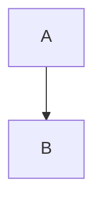

# Obsidian Render

Treat Obsidian as the presentation layer for the learning system.

## Markdown

Use normal headings, lists, tables, code fences, block quotes, and callouts.

Keep the note readable in raw Markdown too.

## MathJax / LaTeX notation

Inline:

```md
$y = Wx + b$
```

Display:

```md
$$
\operatorname{softmax}(x_i)=\frac{e^{x_i}}{\sum_j e^{x_j}}
$$
```

For multi-step derivations:

```md
$$
\begin{aligned}
a &= b+c \\
  &= d
\end{aligned}
$$
```

Define every non-obvious symbol before using it.

Do not put prose inside giant math blocks.

## Mermaid

Use fenced blocks:

````md

````

Keep node text short and avoid complex syntax unless necessary.

## Callouts

Useful semantic callouts:

```md
> [!question] Check
> Why does this edge hold?

> [!warning] Misconception
> The tempting but wrong model is ...

> [!abstract] Generating idea
> ...
```

## Wikilinks

Link durable concepts:

```md
[[Attention]]
[[Bayes rule]]
```

Embed images with:

```md
![[diagram.png|600]]
```

## Rendering principle

Formatting should externalize structure, not decorate it.

Use:
- headings for conceptual levels
- equations for formal relationships
- Mermaid for dependency/flow
- callouts for checks/misconceptions
- wikilinks for durable concept identity
