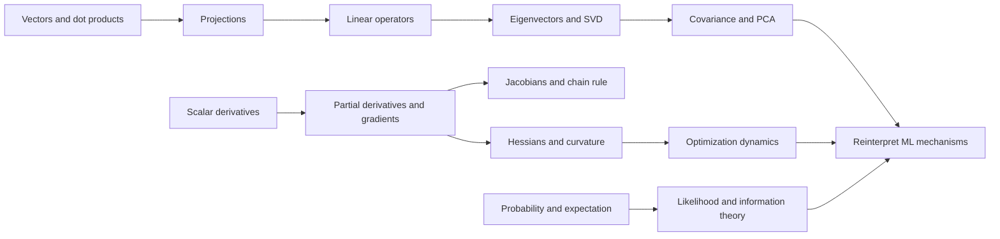

# ML Math Foundations: Diagnostic 1

Answer all six briefly. “I don’t know” is useful evidence. Show your reasoning where you can; do not look things up.

## 1. Vectors and dot products

Let

$$
x=\begin{bmatrix}3\\4\end{bmatrix},
\qquad
v=\begin{bmatrix}1\\0\end{bmatrix}.
$$

What does $v^\top x$ mean geometrically, and what is its value here? What changes if $v$ is not a unit vector?

## 2. Matrix transformations and eigenvectors

Suppose

$$
A=\begin{bmatrix}3&0\\0&1\end{bmatrix}.
$$

Describe geometrically what $A$ does to the plane. Give two eigenvectors and their eigenvalues. In plain language, what makes a vector an eigenvector?

## 3. PCA intuition

Imagine a centered two-dimensional dataset shaped like a long, thin cloud pointing northeast.

Why would projecting onto the cloud’s long direction preserve more information than projecting onto its short direction? How do you think covariance and eigenvectors enter this story? A qualitative answer is enough.

## 4. Multivariable derivatives

For

$$
f(x,y)=x^2+3xy+y^2,
$$

what does the gradient $\nabla f$ represent, and how would you calculate it? If you stood at $(1,1)$, what would the gradient tell you?

## 5. Probability and expectation

A model outputs

$$
P(Y=1\mid x)=0.8.
$$

What exactly does this statement claim? If the true label is $Y=1$, why is $-\log(0.8)$ a sensible loss? Explain without relying only on “because that is cross-entropy.”

## 6. Optimization and curvature

Consider two losses:

$$
L_1(w)=w^2,
\qquad
L_2(w)=100w^2.
$$

They have the same minimizer. Why might the same learning rate behave differently on them? What mathematical object captures this difference, and what do you think this has to do with optimization in neural networks?

## Answer format

Reply with `1.` through `6.`. Keep each answer to roughly 1–5 sentences unless you want to think aloud more fully.

---

# Diagnostic feedback

Your high-level intuition is often pointed in the right direction, but some different mathematical objects are merging together. That is our starting point.

- **Dot product versus projection:** $v^\top x$ is a scalar, not a transformed vector. Here it equals $3$. The vector $\begin{bmatrix}3\\0\end{bmatrix}$ is the projection $vv^\top x$ because $v$ is a unit vector.
- **Non-unit vectors:** changing a vector's length does not normally change its direction. For non-unit $v$, the projection is $\frac{vv^\top x}{v^\top v}$.
- **Eigenvector:** your definition was essentially correct. It is a direction that a transformation does not rotate away from itself: $Av=\lambda v$.
- **PCA:** your long-cloud intuition is useful. The missing link is that covariance is a matrix describing variation by direction; it is not one scalar. Its leading eigenvector identifies the direction with maximum projected variance.
- **Gradient:** you have the rate-of-change intuition, but a multivariable gradient is a vector of partial derivatives. It points toward steepest local increase, not generally toward the origin.
- **Log loss:** your penalty intuition is good. The stated probability was $0.8$, not $0.9$, but that looks like a transcription slip rather than a conceptual issue.
- **Curvature:** magnitude matters, but we need to distinguish function value, slope, and curvature. Derivatives and second derivatives will make the learning-rate behavior precise.

## Provisional learning route



# Diagnostic 2: locate the roots

Answer all six without looking anything up. Short answers are enough.

## 1. Scalar or vector?

Let

$$
a=\begin{bmatrix}2\\1\end{bmatrix},
\qquad
b=\begin{bmatrix}3\\4\end{bmatrix}.
$$

For each expression, say whether the result is a scalar or vector, calculate it if you can, and describe what it means:

$$
a^\top b,
\qquad
ab^\top,
\qquad
(a^\top b)a.
$$

## 2. Projection by reasoning

Let

$$
u=\begin{bmatrix}1/\sqrt{2}\\1/\sqrt{2}\end{bmatrix},
\qquad
x=\begin{bmatrix}2\\0\end{bmatrix}.
$$

Without memorizing a projection formula, reason geometrically about the projection of $x$ onto the line spanned by $u$. What vector should result, and why?

## 3. Eigenvectors of a simple transformation

For

$$
A=\begin{bmatrix}3&0\\0&1\end{bmatrix},
$$

what happens to $e_1=\begin{bmatrix}1\\0\end{bmatrix}$ and $e_2=\begin{bmatrix}0\\1\end{bmatrix}$ after multiplication by $A$? Use $Av=\lambda v$ to identify both eigenvalues.

## 4. Partial derivatives

Given

$$
f(x,y)=x^2+3xy+y^2,
$$

calculate $\frac{\partial f}{\partial x}$ by treating $y$ as a constant, then calculate $\frac{\partial f}{\partial y}$ by treating $x$ as a constant. Combine them into the gradient $\nabla f(x,y)$.

## 5. One gradient-descent step

For

$$
L_1(w)=w^2,
\qquad
L_2(w)=100w^2,
$$

start at $w=1$ and use learning rate $\eta=0.1$. First find each derivative, then apply

$$
w_{\text{new}}=w-\eta\frac{dL}{dw}.
$$

What happens in each case?

## 6. Probability calibration

Two binary classifiers assign the true label probabilities $0.8$ and $0.99$. Without calculating exact decimals, which receives the smaller negative log-likelihood? Would increasing $0.8$ to $0.9$ reduce the loss by the same amount as increasing $0.9$ to $1.0$? Explain your intuition.

Reply with `1.` through `6.` again.

---

# Feedback on Diagnostic 2

## What is working

- $a^\top b=10$ is correct. The raw dot product depends on both angle and vector lengths; cosine similarity removes the length effect.
- $(a^\top b)a=10a=\begin{bmatrix}20\\10\end{bmatrix}$, and your scaling interpretation is correct.
- The eigenpairs are correct: $Ae_1=3e_1$ and $Ae_2=1e_2$.
- Both gradient-descent updates are correct. Reaching $-19$ shows that one learning rate can be stable at one curvature scale and unstable at another.
- A true-label probability of $0.99$ gets the smaller negative log-likelihood. Equal probability increments do not cause equal loss changes.

## Repair 1: inner and outer products

Treat a vertical vector as a column:

$$
a,b\in\mathbb{R}^{2\times1},
\qquad a^\top\in\mathbb{R}^{1\times2}.
$$

The inner product is a scalar:

$$
\underbrace{a^\top}_{1\times2}
\underbrace{b}_{2\times1}
\longrightarrow 1\times1.
$$

The outer product is also valid because its inner dimensions are both $1$:

$$
\underbrace{a}_{2\times1}
\underbrace{b^\top}_{1\times2}
\longrightarrow 2\times2,
$$

$$
ab^\top=
\begin{bmatrix}2\\1\end{bmatrix}
\begin{bmatrix}3&4\end{bmatrix}
=\begin{bmatrix}6&8\\3&4\end{bmatrix}.
$$

As a transformation,

$$
(ab^\top)z=a(b^\top z).
$$

First $b^\top z$ measures alignment with $b$ and produces a scalar. That scalar multiplies $a$, so every output lies along $a$.

For a unit vector $u$, projection has this same structure:

$$
\operatorname{proj}_u(x)=u(u^\top x)=uu^\top x.
$$

Here $u^\top x$ is the signed scalar coordinate; multiplying by $u$ turns it back into a vector. In Question 2,

$$
u^\top x=\sqrt{2},
\qquad u(u^\top x)=\begin{bmatrix}1\\1\end{bmatrix}.
$$

## Repair 2: partial derivatives

For

$$
f(x,y)=x^2+3xy+y^2,
$$

freeze $y$ while differentiating with respect to $x$, and freeze $x$ while differentiating with respect to $y$:

$$
\frac{\partial f}{\partial x}=2x+3y,
\qquad
\frac{\partial f}{\partial y}=3x+2y.
$$

The gradient packages all coordinate-direction slopes into one vector:

$$
\nabla f(x,y)=
\begin{bmatrix}2x+3y\\3x+2y\end{bmatrix}.
$$

# Checkpoint 1: products, projections, and gradients

## 1. Shape reasoning

Suppose $W\in\mathbb{R}^{4\times3}$ and $x\in\mathbb{R}^{3\times1}$. Which of $Wx$, $xW$, and $x^\top W^\top$ are valid? Give the output shape of each valid product.

## 2. Outer-product mechanism

Without multiplying full matrices first, evaluate $(ab^\top)z$ for

$$
a=\begin{bmatrix}2\\1\end{bmatrix},
\quad b=\begin{bmatrix}3\\4\end{bmatrix},
\quad z=\begin{bmatrix}4\\-3\end{bmatrix}.
$$

Use $b^\top z$ followed by $a(b^\top z)$. Why does this particular $z$ produce its result?

## 3. Projection

For

$$
u=\begin{bmatrix}1/\sqrt{2}\\1/\sqrt{2}\end{bmatrix},
\qquad x=\begin{bmatrix}2\\0\end{bmatrix},
$$

separately calculate the scalar coordinate $u^\top x$ and the projected vector $u(u^\top x)$.

## 4. Non-unit projection

Let

$$
v=\begin{bmatrix}2\\0\end{bmatrix},
\qquad x=\begin{bmatrix}3\\4\end{bmatrix}.
$$

Calculate

$$
\frac{v^\top x}{v^\top v}v.
$$

Why is the denominator necessary when $v$ is not a unit vector?

## 5. New gradient

For

$$
g(x,y)=2x^2+4xy+3y^2,
$$

find $\nabla g(x,y)$ and evaluate it at $(1,-1)$. Which direction gives the steepest local decrease from that point?

## 6. Connect to attention

In attention, a score can be written $q^\top k$. Is this an inner or outer product, and what is its output type? What different kind of object would $qk^\top$ produce?

Reply with `1.` through `6.`.

---

# Feedback on Checkpoint 1

## Results

1. **Correct.** $Wx$ has shape $4\times1$, $xW$ is invalid, and $x^\top W^\top$ has shape $1\times4$.
2. **Calculation correct; geometry needs one word changed.** Since $b^\top z=0$, the vectors are **orthogonal**, not opposite. Opposite vectors have a large negative dot product. Because the scalar gate is zero, $a(b^\top z)$ is the zero vector regardless of $a$.
3. **Coordinate correct; reconstruction incorrect.** You found $u^\top x=2/\sqrt{2}=\sqrt{2}$. Then

$$
u(u^\top x)=
\begin{bmatrix}1/\sqrt{2}\\1/\sqrt{2}\end{bmatrix}\sqrt{2}
=\begin{bmatrix}1\\1\end{bmatrix}.
$$

4. **Explanation directionally correct; calculation missing.** Here $v^\top x=6$ and $v^\top v=4$, so

$$
\frac{v^\top x}{v^\top v}v
=\frac64\begin{bmatrix}2\\0\end{bmatrix}
=\begin{bmatrix}3\\0\end{bmatrix}.
$$

The denominator cancels the arbitrary scaling of the direction vector. Replacing $v$ by $10v$ must not change the line or the projection.

5. **Method understood; cross-term coefficients dropped.** For $g(x,y)=2x^2+4xy+3y^2$,

$$
\nabla g(x,y)=
\begin{bmatrix}4x+4y\\4x+6y\end{bmatrix}.
$$

Thus

$$
\nabla g(1,-1)=\begin{bmatrix}0\\-2\end{bmatrix},
\qquad
-\nabla g(1,-1)=\begin{bmatrix}0\\2\end{bmatrix}.
$$

Your rule that the negative gradient gives steepest local decrease was correct.

6. **You described matrix attention correctly, but the question used individual vectors.** Keep lowercase and uppercase objects separate:

$$
q,k\in\mathbb{R}^{d\times1}
\quad\Longrightarrow\quad
q^\top k\in\mathbb{R}
\quad\text{and}\quad
qk^\top\in\mathbb{R}^{d\times d}.
$$

For all tokens at once,

$$
Q,K\in\mathbb{R}^{n\times d}
\quad\Longrightarrow\quad
QK^\top\in\mathbb{R}^{n\times n}.
$$

Your sequence-by-sequence interpretation belongs to $QK^\top$, not the single-query score $q^\top k$.

# Generating idea: preserve object type through every step

Before interpreting an expression, annotate its shapes. After every operation, state what kind of object remains:

```text
vector × vector -> scalar coordinate
scalar × vector -> vector on a chosen line
matrix × vector -> transformed vector
matrix × matrix -> operator or table of pairwise relations
```

The same discipline applies in calculus: while taking $\partial/\partial x$, everything containing no $x$ is a constant, but coefficients involving $y$ remain.

# Checkpoint 2: object tracking

## 1. Orthogonal versus opposite

Let

$$
b=\begin{bmatrix}3\\4\end{bmatrix},
\quad
z_1=\begin{bmatrix}4\\-3\end{bmatrix},
\quad
z_2=\begin{bmatrix}-3\\-4\end{bmatrix}.
$$

Calculate $b^\top z_1$ and $b^\top z_2$. Which vector is orthogonal to $b$, which is opposite to $b$, and how does the sign of the dot product reveal the difference?

## 2. Projection invariance

Project $x=\begin{bmatrix}3\\4\end{bmatrix}$ onto the line represented first by $v=\begin{bmatrix}2\\0\end{bmatrix}$ and then by $w=\begin{bmatrix}10\\0\end{bmatrix}$, using

$$
\operatorname{proj}_v(x)=\frac{v^\top x}{v^\top v}v.
$$

Show that both representations of the same line produce the same vector.

## 3. Single-token versus all-token attention

Suppose $q,k\in\mathbb{R}^{64\times1}$ and $Q,K\in\mathbb{R}^{128\times64}$. Give the shape and meaning of each:

$$
q^\top k,
\qquad qk^\top,
\qquad QK^\top.
$$

## 4. Partial derivatives with a cross-term

For

$$
h(x,y)=5x^2+7xy+2y^2,
$$

find $\frac{\partial h}{\partial x}$, $\frac{\partial h}{\partial y}$, and $\nabla h(1,2)$.

## 5. Direction from a gradient

Suppose $\nabla L(w_1,w_2)=\begin{bmatrix}3\\-4\end{bmatrix}$ at the current point. Give a unit vector pointing in the steepest-descent direction. Explain why merely pointing toward the coordinate origin would not generally answer this question.

Reply with `1.` through `5.`.

---

# Feedback on Checkpoint 2

## Three precise repairs

1. For $z_2=-b$, the raw dot product is $b^\top z_2=-25$. The **cosine similarity** is $-1$ after dividing by both lengths. Your geometric classification was correct: $z_1$ is orthogonal and $z_2$ is opposite.

2. The outer product $qk^\top\in\mathbb{R}^{64\times64}$ does not compare one token with 64 keys. Both vectors describe one token in 64 feature coordinates. Entry $(i,j)$ is $q_i k_j$, so the matrix records pairwise query-feature/key-feature interactions. Token-to-token comparisons appear after stacking tokens into $Q,K\in\mathbb{R}^{n\times d}$ and calculating $QK^\top\in\mathbb{R}^{n\times n}$.

3. The negative gradient is $\begin{bmatrix}-3\\4\end{bmatrix}$. Its length is $5$, so the unit steepest-descent direction is

$$
\begin{bmatrix}-3/5\\4/5\end{bmatrix}.
$$

Pointing toward the origin could increase the loss. The coordinate origin says nothing about local slope unless the loss has special structure.

# Tier A node: why eigenvectors produce PCA

## The problem

Each centered example is $x_i\in\mathbb{R}^d$. We want one scalar coordinate per example while preserving as much variation as possible:

$$
z_i=v^\top x_i,
\qquad \|v\|=1.
$$

The unit constraint prevents us from creating arbitrary variance merely by scaling $v$.

## Covariance is an average outer product

For centered data,

$$
C=\frac1n\sum_{i=1}^n x_i x_i^\top.
$$

Each $x_i x_i^\top$ is a $d\times d$ feature-by-feature matrix. Its $(j,k)$ entry is $(x_i)_j(x_i)_k$. Averaging tells us which feature directions vary together. This is why covariance is a matrix rather than one variance number.

## Projected variance becomes a quadratic form

Because $z_i=v^\top x_i$ is centered,

$$
\begin{aligned}
\operatorname{Var}(z)
&=\frac1n\sum_{i=1}^n z_i^2\\
&=\frac1n\sum_{i=1}^n (v^\top x_i)^2\\
&=\frac1n\sum_{i=1}^n v^\top x_i x_i^\top v\\
&=v^\top\left(\frac1n\sum_{i=1}^n x_i x_i^\top\right)v\\
&=v^\top C v.
\end{aligned}
$$

Operationally:

```text
v -> C transforms v -> dot the result with v -> scalar variance along v
```

## Why the leading eigenvector wins

A covariance matrix is symmetric, so it has orthonormal eigenvectors $e_1,\ldots,e_d$. Any unit direction can be written

$$
v=\sum_{j=1}^d \alpha_j e_j,
\qquad \sum_{j=1}^d \alpha_j^2=1.
$$

If $Ce_j=\lambda_j e_j$, then

$$
v^\top C v=\sum_{j=1}^d \lambda_j\alpha_j^2.
$$

This is a weighted average of the eigenvalues. Every weight $\alpha_j^2$ is nonnegative and the weights sum to $1$, so it cannot exceed the largest eigenvalue. The maximum occurs when all weight lies on its eigenvector:

$$
v=e_{\max},
\qquad v^\top C v=\lambda_{\max}.
$$

> The leading eigenvector of the covariance matrix is the unit direction along which the data has maximum variance; its eigenvalue is that variance.

Additional principal components use the next-largest eigenvalues while remaining orthogonal to earlier components.

# PCA Checkpoint

Use this centered dataset:

$$
x_1=\begin{bmatrix}2\\0\end{bmatrix},
\quad x_2=\begin{bmatrix}-2\\0\end{bmatrix},
\quad x_3=\begin{bmatrix}0\\1\end{bmatrix},
\quad x_4=\begin{bmatrix}0\\-1\end{bmatrix}.
$$

## 1. Build covariance

Calculate each $x_i x_i^\top$, add them, and divide by $4$ to find $C$.

## 2. Read covariance geometrically

Without using a determinant, identify the two eigenvectors of $C$ and their eigenvalues. Which direction contains more variance?

## 3. Verify directional variance

Calculate $v^\top C v$ for $v=e_1=\begin{bmatrix}1\\0\end{bmatrix}$ and for $v=e_2=\begin{bmatrix}0\\1\end{bmatrix}$. Interpret both results.

## 4. Explain the maximum

Let

$$
v=\alpha e_1+\beta e_2,
\qquad \alpha^2+\beta^2=1.
$$

Rewrite $v^\top C v$ using $\alpha$, $\beta$, and the two eigenvalues. Explain why no mixed direction can preserve more variance than $e_1$.

## 5. Compression and reconstruction

If PCA keeps only $e_1$, store each point as $z_i=e_1^\top x_i$ and reconstruct it as $\hat{x}_i=z_i e_1$. Reconstruct all four points. Which information is lost, and why is this the least costly one-dimensional choice?

Reply with `1.` through `5.`.
