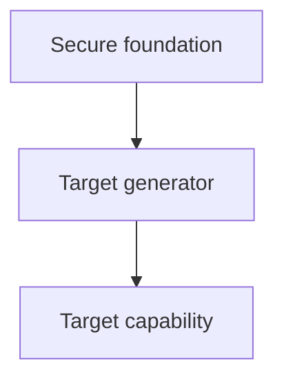

# {{topic}}

## Target capability

What should I be able to derive, explain, predict, implement, or transfer by the end?

## Diagnostic model

### Secure foundations

### Frontier

### Misconceptions

### Remaining uncertainty

## Plan

### Tier A — target generators

### Tier B — enabling prerequisites

### Deferred / parking lot

## Teaching log

Keep only explanations, derivations, and decisions worth revisiting; do not store a raw transcript.

## Evidence checkpoints

Record only evidence that changes the learner model.

| Concept | Question type | What it discriminated | Result | Interpretation |
|---|---|---|---|---|

## Exit evaluation

Use novel prompts.

### Mechanism / meaning

### Reconstruction

### Transfer

### Boundary / misconception

### Integration

## Session compression

### Smallest set of generating ideas

### Facts now derivable rather than memorized

### Remaining fragile edges

## Persistence update

- Concept notes created/updated:
- Learner Model changes:
- Misconceptions:
- Review targets:
- Next high-leverage node:
